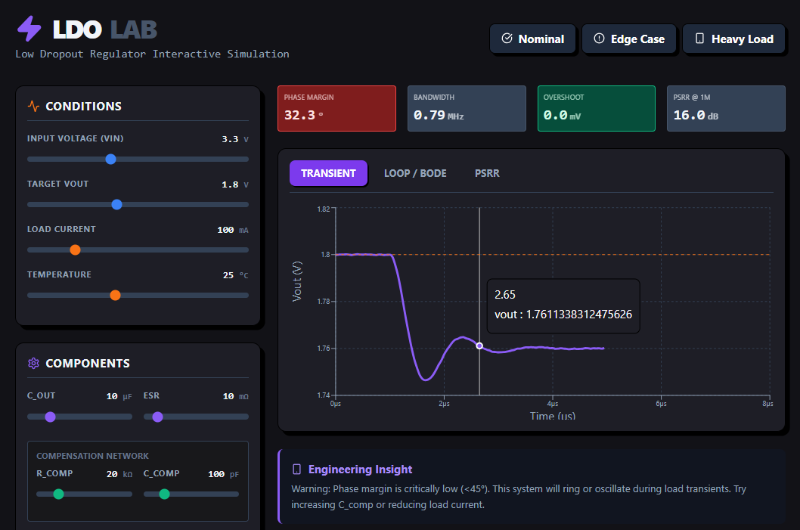

<center>





## LDO LAB

</center>


A browser-based LDO (Low Dropout Regulator) simulator powered by **Pyodide** (Python in WebAssembly) and **React**, with no backend required.

## Features

- **Real-time transient simulation**: Load-step response with second-order damping analysis.
- **Bode plot & phase margin**: Loop gain and stability metrics.
- **PSRR analysis**: Power Supply Rejection Ratio vs. frequency.
- **Live circuit diagram**: Interactive SVG showing real-time component values.
- **PVT corner support**: Extend to analyze process/voltage/temperature variations (future).
- **Presets**: Quick configurations (Nominal, Edge Case, Heavy Load).


## Architecture

- **Frontend**: React + Recharts (plotting) + Lucide (icons)
- **Backend**: Pyodide (Python 3 in WASM) running in a Web Worker
- **Styling**: Vanilla CSS, Neo-Brutalist dark theme
- **Hosting**: GitHub Pages (`https://j143.github.io/ldo/`)

## Controls & Outputs

### Input Controls
- **Supply & Load**: Vin, Vout target, load current, temperature
- **Output Network**: Capacitance (µF), ESR (mΩ)
- **Compensation**: Rcomp (kΩ), Ccomp (pF)

### Output Plots
1. **Transient**: Vout vs. time (load-step response)
2. **Bode**: Magnitude (dB) & phase (°) vs. frequency
3. **PSRR**: Power supply rejection ratio vs. frequency

### KPIs
- Phase Margin (°)
- Bandwidth (MHz)
- Overshoot (mV)
- PSRR @ 1MHz (dB)

## File Structure

```
web/
├── src/
│   ├── app.js          # Main React component
│   ├── py-worker.js    # Pyodide worker + Python LDO model
│   ├── main.jsx        # Entry point
│   └── styles.css      # Vanilla CSS (neo-brutalist)
├── index.html
├── vite.config.js
└── package.json
```

## Deployment

This repo is configured for **GitHub Pages** via GitHub Actions (`.github/workflows/gh-pages.yml`).

1. Push to `main` → GitHub Actions builds the React app
2. Artifacts deployed to `gh-pages` branch
3. Live at `https://j143.github.io/ldo/`

To enable:
1. Go to **Settings** > **Pages**
2. Select `Deploy from a branch`
3. Choose `gh-pages` / `/ (root)`

## Models & Assumptions

### Transient Response
- Second-order system with damping derived from phase margin
- Load step at t=1µs
- Temperature-dependent noise injection

### Bode Analysis
- Type-II compensator (one zero, one pole)
- Output stage modeled as RC pole
- DC loop gain scales with load current

### PSRR
- Simplified single-pole roll-off above ~100 kHz
- Improves at low frequency, degrades at high frequency

**Note**: This is an analytical approximation. For production designs, correlate with **SPICE** or **ngspice**.

## Future Enhancements

- [ ] PVT corner sweeps (temperature, voltage, process variation)
- [ ] Monte Carlo analysis (parameter uncertainty)
- [ ] Transient noise analysis
- [ ] Export results (JSON, PNG)
- [ ] SPICE netlist import/export
- [ ] Multi-channel LDO support

